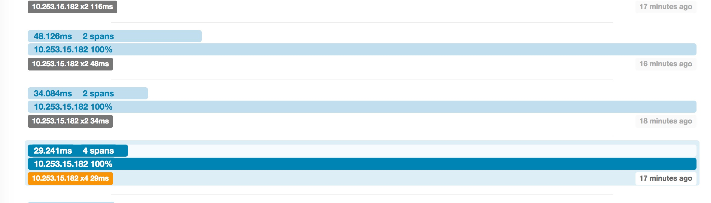
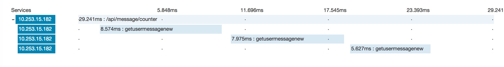

## zipkin服务集成

用于链路日志收集后半部分kafka->elasticsearch的服务

> 前半部分集成brave工程输出日志到zipkin.log-> flume -> kafka

## 集成方式

1. 原生工程接口启动
2. Spring Boot工程接口启动(集成ui环境)

## flume集成

```
zipkin.sources = s1
zipkin.channels = c1
zipkin.sinks = k1

# For each one of the sources, the type is defined
zipkin.sources.s1.type = exec
zipkin.sources.s1.shell = /bin/bash -c
zipkin.sources.s1.command = tail -F /usr/local/tv-log/zipkin/zipkin.log
zipkin.sources.s1.channels = c1
# The channel can be defined as follows.

# Each sink's type must be defined
zipkin.sinks.k1.type = org.apache.flume.sink.kafka.KafkaSink
zipkin.sinks.k1.kafka.bootstrap.servers=10.253.15.182:9092
zipkin.sinks.k1.kafka.topic=zipkin
zipkin.sinks.k1.partition.key=0
zipkin.sinks.k1.partitioner.class=org.apache.flume.plugins.SinglePartition
zipkin.sinks.k1.serializer.class=kafka.serializer.StringEncoder
zipkin.sinks.k1.request.required.acks=0
zipkin.sinks.k1.max.message.size=1000000
zipkin.sinks.k1.producer.type=sync
#Specify the channel the sink should use
zipkin.sinks.k1.channel = c1

# Each channel's type is defined.
zipkin.channels.c1.type = memory

# Other config values specific to each type of channel(sink or source)
# can be defined as well
# In this case, it specifies the capacity of the memory channel
zipkin.channels.memoryChannel.capacity = 100

```

nohup flume-ng agent -n zipkin -c conf -f conf/flume-zipkin-conf.properties &


## elasticsearch集成

执行bootstrap工程从kafka读取数据

index截图

 

span截图


UI

traces列表



span明细



 
## 问题汇总

1. kafka的offset默认smallest,如何维护group对应的offset是否和spark一样需要自己手动维护,需要验证
2. 1.32的zipkin会多生成一个type类型
